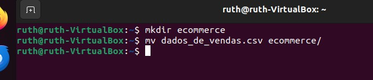
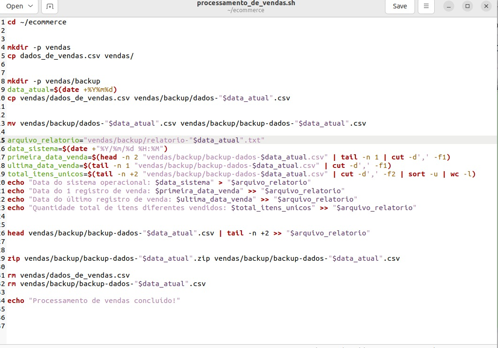
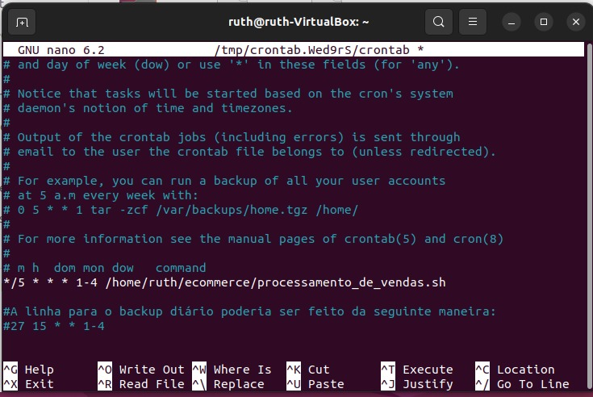
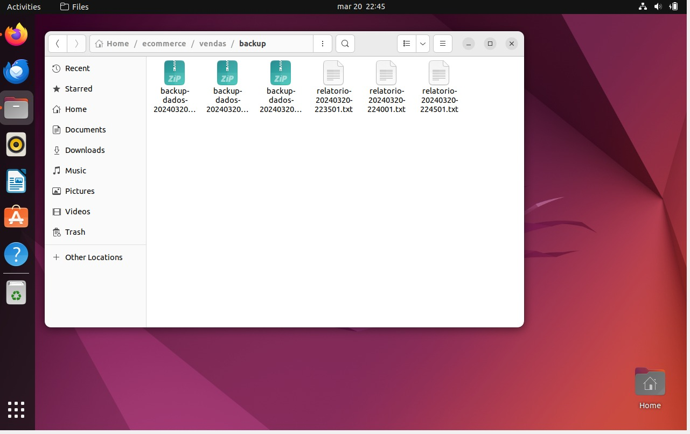
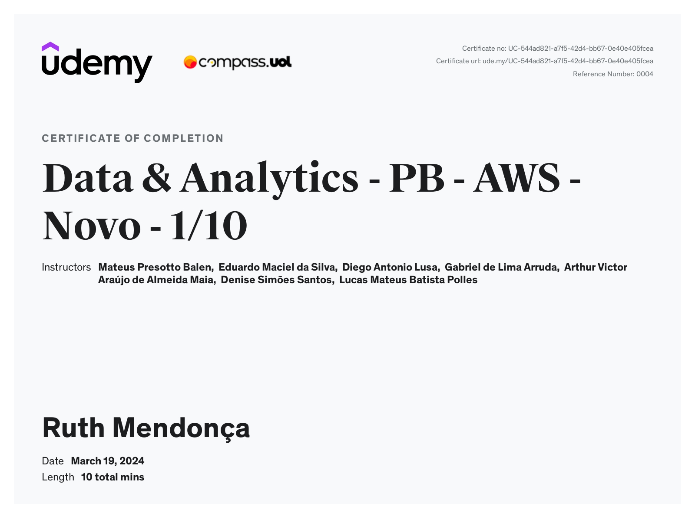
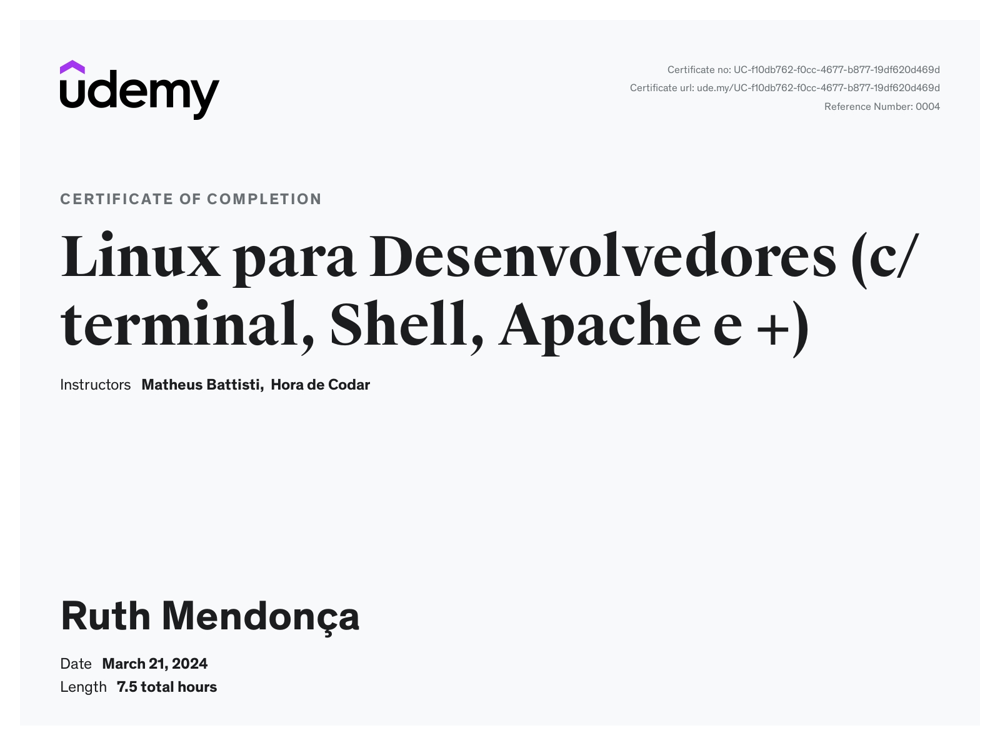

# Exercícios

1. ...
[Script Processamento_de_vendas.sh](exercicios/ecommerce/consolidador_de_processamento_de_vendas.sh)

2. ...
[Script Consolidador_de_processamento_de_vendas.sh](exercicios/ecommerce/consolidador_de_processamento_de_vendas.sh)

3. ...
[Diretório Vendas](exercicios/ecommerce/vendas)

4. ...
[Relatório Final](exercicios/ecommerce/relatorio_final.txt)

# Evidências

Ao executar este código do exercício, foi criada a pasta ecommerce e o arquivo dados_de_vendas.csv foi movido para o diretório criado:

Evidência do script processamento_de_vendas.sh:

Evidência do Agendamento:

Evidência dos relátorios gerados:

# Certificados

- Certificado do Curso ABC

- Certificado do Curso Linux para Desenvolvedores

